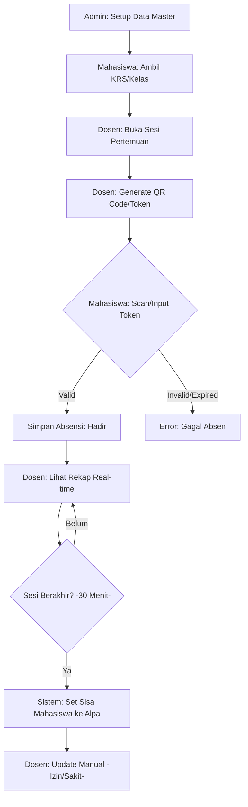
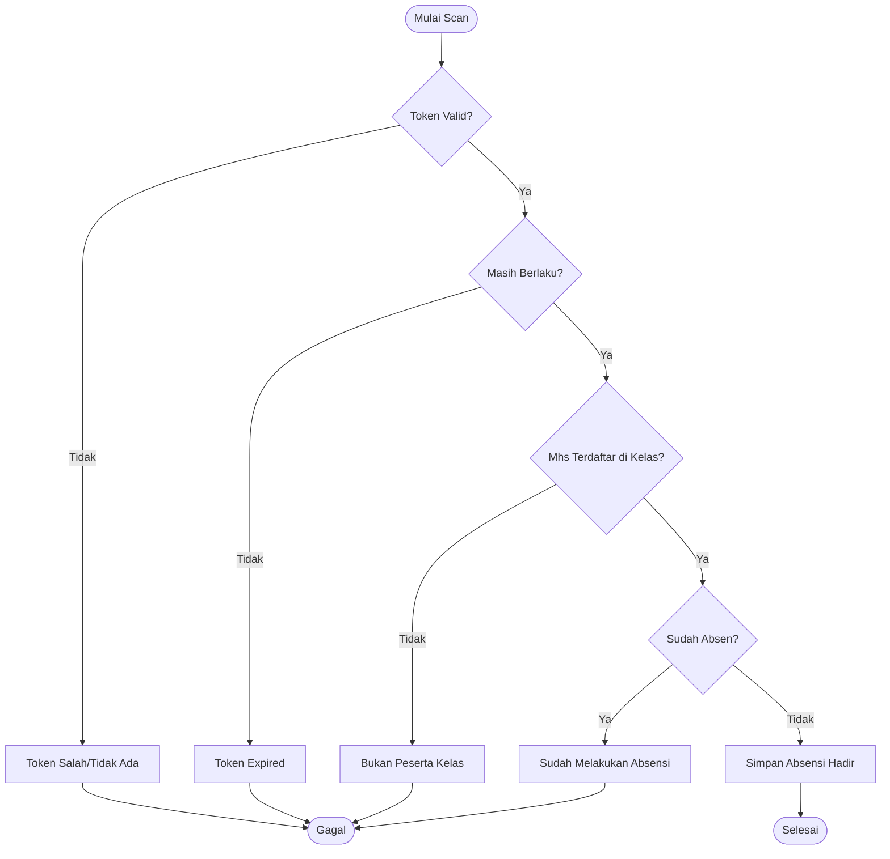

# Mahasiswa Absensi QR Code - Project Flow

Proyek ini adalah sistem absensi mahasiswa berbasis QR Code yang dibangun menggunakan framework **CodeIgniter 3**.

## 📊 Visualisasi Alur (Flowchart)

### 1. Alur Utama Sistem

### 2. Alur Validasi Scan (Detil)

---

## 👥 Aktor & Peran (Roles)

1. **Admin**: Mengelola data master (Mahasiswa, Dosen, Matakuliah, Kelas, dan Akun Pengguna).
2. **Dosen**: Mengelola sesi perkuliahan (Pertemuan), membuat QR Code, dan melihat rekap absensi.
3. **Mahasiswa**: Mengambil rencana studi (KRS) dan melakukan absensi dengan memindai (scan) QR Code.

---

## 🔄 Alur Utama Sistem (Main Workflow)

### 1. Tahap Persiapan (Admin)
- Admin menambahkan data **Dosen** dan **Mahasiswa**.
- Admin mengelola daftar **Mata Kuliah**.
- Admin membuat **Kelas** (Menautkan Dosen dengan Mata Kuliah).

### 2. Pengambilan Mata Kuliah (Mahasiswa)
- Mahasiswa login dan masuk ke menu **KRS**.
- Mahasiswa memilih kelas yang tersedia untuk diikuti.
- Data ini disimpan di tabel `tb_krs`.

### 3. Sesi Perkuliahan & Absensi (Dosen & Mahasiswa)
1. **Dosen** masuk ke menu Absensi dan memilih kelas yang sedang berlangsung.
2. **Dosen** membuat **Pertemuan** baru (misal: Pertemuan ke-1).
3. **Dosen** menekan tombol **Generate QR**.
   - Sistem membuat token unik 8 karakter.
   - Token berlaku selama **30 menit**.
4. **Mahasiswa** masuk ke menu **Scan QR**.
5. **Mahasiswa** melakukan scan atau memasukkan token yang ditampilkan dosen.
   - **Validasi Sistem**:
     - Apakah token benar?
     - Apakah token sudah expired (> 30 mnt)?
     - Apakah mahasiswa terdaftar di KRS kelas tersebut?
     - Apakah mahasiswa sudah absen sebelumnya?
6. Jika valid, data kehadiran disimpan di `tb_absensi` dengan status **Hadir**.

### 4. Monitoring & Rekap (Dosen)
- Dosen dapat melihat daftar mahasiswa yang sudah scan secara real-time.
- Setelah sesi QR berakhir (30 menit), sistem secara otomatis menganggap mahasiswa yang tidak scan sebagai **Alpa**.
- Dosen dapat mengubah status secara manual (misal: dari Alpa ke **Izin** atau **Sakit**).

---

## 📊 Struktur Database Inti
- `tb_operator`: Akun login (Admin/Dosen/Mahasiswa).
- `tb_mahasiswa` & `tb_dosen`: Profil detil user.
- `tb_matakuliah`: Data mata kuliah.
- `tb_kelas`: Hubungan Matkul + Dosen.
- `tb_krs`: Daftar mahasiswa di setiap kelas.
- `tb_pertemuan`: Sesi kelas per tanggal.
- `tb_qrcode`: Token QR yang aktif per pertemuan.
- `tb_absensi`: Record kehadiran mahasiswa.

---

## 🛠 Teknologi yang Digunakan
- **Backend**: PHP (CodeIgniter 3)
- **Frontend**: Bootstrap 4 & AdminLTE
- **Database**: MySQL
- **Library**: phpqrcode (untuk generate gambar QR)
